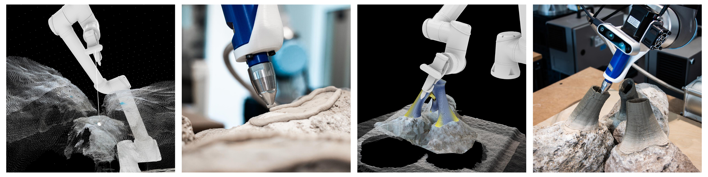

# Sequenced Robotic Toolpaths: 3D Scanning and Bio-Printing on Organic Topology
###### A scan-to-fabrication workflow integrating sensing, computation, and robotic deposition on organic geometries

## Overview

**Dates:** April 26–28, 2025  |  **Location:** NYCU ([Map](https://maps.app.goo.gl/PSBTLGFX5YvoPecu8))  |  **Duration:** 3 Days  |  **Hours:** 7 hrs (9:30–13:00 & 14:00–17:30)  
**Instructors:** Celso Urroz, Heidi Sekardini, Hangchuan Wei 

[**Workshop Daily Breakdown**](https://docs.google.com/spreadsheets/d/17_4w_V5P2qwq9HPzM9tP29DjK2Ff99BC/edit?gid=1288693011#gid=1288693011) 

This workshop introduces a **scan-to-toolpath pipeline** for robotic bio-printing on organic geometries. Participants will work across sensing, computation, and fabrication, linking:

- 3D scanning (RealSense)  
- Point cloud processing  
- Toolpath generation in Grasshopper  
- Robotic control using KUKA|PRC  
- Non-planar printing strategies

## Software Requirements

### Core Software
- **Rhinoceros 8**
- [RealSense SDK 2.0 Bundle](https://github.com/realsenseai/librealsense/releases/download/v2.57.7/RealSense.SDK-WIN10-2.57.7.10378.exe)
- [SideFX Houdini](https://www.sidefx.com/download) (Install via launcher, use free Apprentice license) 
  
### Grasshopper Plugins
- [Persistent Data Editor](https://www.food4rhino.com/en/app/persistent-data-editor) (Package Manager) - *Improves GH UI (Optional)*  
- [Sunglasses](https://www.food4rhino.com/en/app/sunglasses) (Food4Rhino) - *Improves GH UI (Optional)*
- [Heteroptera](https://www.food4rhino.com/en/app/heteroptera) (Package Manager) - *Useful tools*
- [Pufferfish](https://www.food4rhino.com/en/app/pufferfish) (Food4Rhino) - *Useful tools*
- [Watchdog](https://www.food4rhino.com/en/app/watchdog) (Package Manager) - *Avoid Rhino freeze (Optional)*
- [Radii Capture (RealSense)](https://www.food4rhino.com/en/app/radii-capture-realsense) (Food4Rhino) - *RealSense control in GH* 

- [KUKA|PRC Pro](https://www.food4rhino.com/en/app/kukaprc-parametric-robot-control-grasshopper) - *Robot control in GH*  
  Johannes Braumann (Robots in Architecture) provided trial licenses (Expires 31/07/26).  
  (1) Delete existing KUKA|PRC from GH "Components Folder" (if installed)  
  (2) Run [KUKA|PRC Installer](KUKA_PRC_Pro/KUKAprcGH_20260420.exe)  
  (3) Replace license with [KUKAprcLicense.json](KUKA_PRC_Pro/KUKAprcLicense.json)  

## Workshop Structure

### Day 1 — Workflow + Scan-to-Toolpath Pipeline

Focus: **System overview + sensing + basic robotic control**

#### Topics
- KUKA|PRC fundamentals
- Robot coordinate systems & safety logic
- Grasshopper-RealSense scanning workflow
- Introduction to non-planar toolpath generation using differential growth 

#### Files

- [🦗 0.KUKAPRC_Robot_Control_Breakdown.gh](Grasshopper_Houdini/Day_1/0.KUKAPRC_Robot_Control_Breakdown.gh) → Robot setup, motion logic, and command structure  
- [🦗 1.Scan&Probe.gh](Grasshopper_Houdini/Day_1/1.Scan&Probe.gh) → Real-time scanning and spatial probing  
- [🦗 2.ConformalPrintingGrowth.gh](Grasshopper_Houdini/Day_1/2.ConformalPrintingGrowth.gh) → Translating scan data into growth-based toolpaths  

### Day 2 — Dual Extrusion + Generative Toolpaths

> [!WARNING]  
> This section is Work-in-progress.

Focus: **Material logic + toolpath intelligence**

#### Topics
- Dual extrusion system setup
- Material switching strategies
- Generative pattern systems using Houdini
- Grasshopper to Houdini bridge
- Data-driven deposition logic

#### Outcomes
- Multi-material toolpaths
- Controlled variation in extrusion behavior
- Integration of geometry and fabrication constraints

#### Files

- [🦗 1.KUKAPRC_Robot_Control_Breakdown.gh](Grasshopper_Houdini/Day_1/1.KUKAPRC_Robot_Control_Breakdown.gh) → Main file
- [🌀 1.Houdini.hip](Grasshopper_Houdini/Day_1/1.KUKAPRC_Robot_Control_Breakdown.gh) → Robot setup, motion logic, and command structure  
- [🌀 2.Houdini.hip](Grasshopper_Houdini/Day_1/2.Scan&Probe.gh) → Real-time scanning and spatial probing  
- [🌀 3.Houdini.hip](Grasshopper_Houdini/Day_1/3.Scan&PrintGrowth.gh) → Translating scan data into growth-based toolpaths  

### Day 3 — Multi-Object Composition + Non-Planar Printing

> [!WARNING]  
> This section is Work-in-progress.

Focus: **Complex fabrication + final production**

#### Topics
- Multi-object coordination
- Non-planar slicing strategies
- Collision-aware toolpaths
- Adaptive deposition on irregular substrates
- Final robotic print

#### Outcomes
- Fully integrated scan-to-print workflow
- Fabrication of complex, non-planar bio-printed structures

## Acknowledgments

Special thanks to:

**Robots in Architecture** for providing KUKA|PRC Pro licenses and CAADRIA 2026 Workshop organizers and staff.

## License

This repository is intended for **educational use** within the workshop context.  
For reuse or distribution, please contact the authors.

